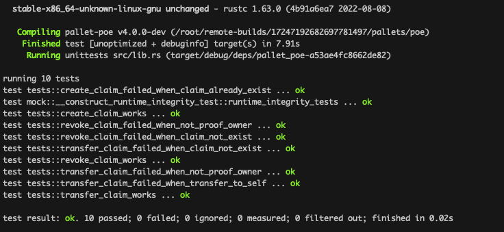

# 运行测试


# 测试样例

## 创建存证的测试用例

### 创建存证成功
```Rust
#[test]
fn create_claim_works() {
	new_test_ext().execute_with(|| {
		let claim = vec![0, 1];
		let bounded_claim = 
			BoundedVec::<u8, <Test as Config>::MaxBytesInHash>::try_from(claim).unwrap();

		assert_ok!(PoeModule::create_claim(Origin::signed(1), bounded_claim.clone()));
		assert_eq!(
			Proofs::<Test>::get(&bounded_claim),
			Some((1, frame_system::Pallet::<Test>::block_number()))
		);
	})
}
```

### 创建存证重复创建失败

```Rust
#[test]
fn create_claim_failed_when_claim_already_exist() {
	new_test_ext().execute_with(|| {
		let claim = vec![0, 1];
		let bounded_claim = 
			BoundedVec::<u8, <Test as Config>::MaxBytesInHash>::try_from(claim).unwrap();
		let _ = PoeModule::create_claim(Origin::signed(1), bounded_claim.clone());
		
		assert_noop!(
			PoeModule::create_claim(Origin::signed(1), bounded_claim.clone()),
			Error::<Test>::ProofAlreadyClaimed
		);
	})
}
```

## 撤销存证的测试用例

### 撤销存证成功

```Rust
#[test]
fn revoke_claim_works() {
	new_test_ext().execute_with(|| {
		let claim = vec![0, 1];
		let bounded_claim = 
			BoundedVec::<u8, <Test as Config>::MaxBytesInHash>::try_from(claim).unwrap();

		assert_ok!(PoeModule::create_claim(Origin::signed(1), bounded_claim.clone()));
		assert_ok!(PoeModule::revoke_claim(Origin::signed(1), bounded_claim.clone()));
	})
}
```

### 撤销存证失败存证不存在

```Rust
#[test]
fn revoke_claim_failed_when_claim_not_exist() {
	new_test_ext().execute_with(|| {
		let claim = vec![0, 1];
		let bounded_claim = 
			BoundedVec::<u8, <Test as Config>::MaxBytesInHash>::try_from(claim).unwrap();

		assert_noop!(
			PoeModule::revoke_claim(Origin::signed(1), bounded_claim.clone()),
			Error::<Test>::NoSuchProof
		);
	})
}
```

### 撤销存证失败非存证所有者

```Rust
#[test]
fn revoke_claim_failed_when_not_proof_owner() {
	new_test_ext().execute_with(|| {
		let claim = vec![0, 1];
		let bounded_claim = 
			BoundedVec::<u8, <Test as Config>::MaxBytesInHash>::try_from(claim).unwrap();
		
		assert_ok!(PoeModule::create_claim(Origin::signed(1), bounded_claim.clone()));
		assert_noop!(
			PoeModule::revoke_claim(Origin::signed(2), bounded_claim.clone()),
			Error::<Test>::NotProofOwner
		);
	})
}
```

## 转移存证的测试用例

### 转移存证成功

```Rust
#[test]
fn transfer_claim_works() {
	new_test_ext().execute_with(|| {
		let claim = vec![0, 1];
		let bounded_claim = 
			BoundedVec::<u8, <Test as Config>::MaxBytesInHash>::try_from(claim).unwrap();
		
		let to_address: u64 = 2;

		assert_ok!(PoeModule::create_claim(Origin::signed(1), bounded_claim.clone()));
		assert_ok!(PoeModule::transfer_claim(Origin::signed(1), to_address, bounded_claim.clone()));
	})
}
```

### 转移存证失败存证不存在

```Rust
#[test]
fn transfer_claim_failed_when_claim_not_exist() {
	new_test_ext().execute_with(|| {
		let claim = vec![0, 1];
		let bounded_claim = 
			BoundedVec::<u8, <Test as Config>::MaxBytesInHash>::try_from(claim).unwrap();
		
		let to_address: u64 = 2;

		assert_noop!(
			PoeModule::transfer_claim(Origin::signed(1), to_address, bounded_claim.clone()),
			Error::<Test>::NoSuchProof
		);
	})
}
```

### 转移存证失败非存证所有者
```Rust
#[test]
fn transfer_claim_failed_when_not_proof_owner() {
	new_test_ext().execute_with(|| {
		let claim = vec![0, 1];
		let bounded_claim = 
			BoundedVec::<u8, <Test as Config>::MaxBytesInHash>::try_from(claim).unwrap();
		
		let to_address: u64 = 3;

		assert_ok!(PoeModule::create_claim(Origin::signed(1), bounded_claim.clone()));
		assert_noop!(
			PoeModule::transfer_claim(Origin::signed(2), to_address, bounded_claim.clone()),
			Error::<Test>::NotProofOwner
		);
	})
}
```

### 转移存证失败向自己转移
```Rust
#[test]
fn transfer_claim_failed_when_transfer_to_self() {
	new_test_ext().execute_with(|| {
		let claim = vec![0, 1];
		let bounded_claim = 
			BoundedVec::<u8, <Test as Config>::MaxBytesInHash>::try_from(claim).unwrap();
		
		let to_address: u64 = 1;

		assert_ok!(PoeModule::create_claim(Origin::signed(1), bounded_claim.clone()));
		assert_noop!(
			PoeModule::transfer_claim(Origin::signed(1), to_address, bounded_claim.clone()),
			Error::<Test>::TransferToSelf
		);
	})
}
```